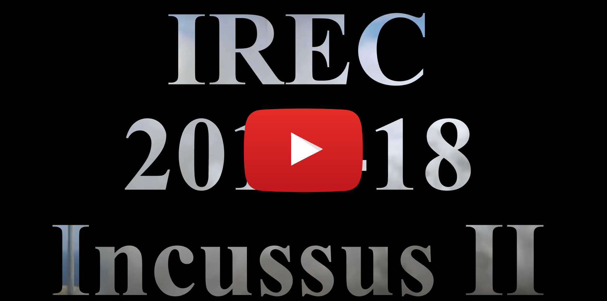

## SEDS-UCF IREC Payload Team Lead

For the 2016-17 academic year, I participated in the Intercollegiate Rocket Engineering Competition as Team Lead of the SEDS-UCF team "Incussus." My role primarily comprised of leading the Payload subteam to successfully designing, and manufacuturing, a 3U formfactor microgravity experiment. 
 

### CAD Utilizing SolidWorks

While this work was shared across several teammates, my design contributions were related to a few selected components. These include recessing a Pi Camera v2 into a polycarbonate wall, modifying mounting and retaining hardware for the regolith launcher assembly, and developing an electronics mount.   

Full view of "PRIME-R" microgravity experiment 
   

Closeup view of electronics bay 
   

Closeup view of vacuum chamber with walls transparent 

 

### Promotional Video

