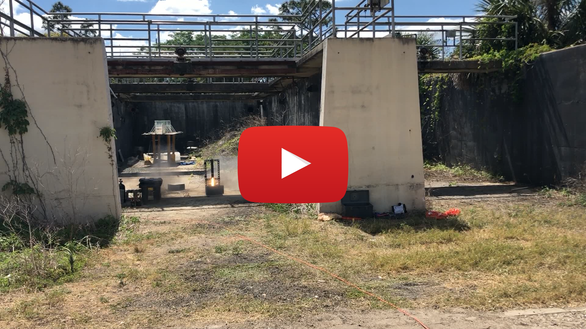

## FSGC Hybrid Rocket "Gold" Senior Design Team Lead

### Project Description 
During the final semesters of the Aerospace Engineering program at UCF, every student is required to participate in Senior Design for two semesters. The team that I was paired with collectively chose to particiipate in the Florida Space Grant Consortium Hybrid Rocket Competition. While the competition never materialized due to COVID-19, the team was able to develop a mature vehicle design, as well as complete static fire engine testing. My specific contributions were a mix of several roles including but not limited to defining requirements based on customer requests, CAD design utilizing said requirements, and basic CFD analysis in order to characterize coefficients of drag. In addition to these technical roles, I was selected to be the "team lead" which involved my being the primary liason between the team and our advisor Kyle Davidson. 

### Concept Design

 

Pugh Matrix values used to make determinations for concept design selection 

 

 

Graphical representation of pugh matrix scores 

 

### CAD utilizing SolidWorks

For the FSGC Hybrid Rocket system, I was tasked with developing a full engine system CAD. This is comprised of a custom retainer design, bulkheads, and nozzle geometry. 

 

 

Forward and aft views of full engine system. 

 

 

Cross-sectional view of full engine system. 

  

Custom engine retainer hardware design. 

 

### CFD Utilizing ANSYS Fluent

In order to validate assumptions made for nose cone shape selection, I performed fluid flow simulations over the different profiles selected.

 

 

CFD Plots for velocity and pressure contours. The final image is both layers stacked. 

### Manufacturing Utilizing Conventional Mill & Lathe

Given my background in machining, the team tasked me with manufacturing specific components of the system. Due to COVID-19, the retainer system never materialized. One nozzle was produced for testing, however. 

Graphite stock mounted on a lathe prior to final cuts 

Finished lathe for engine testing. 

### Engine Testing

In collaboration with a few members of the team, I assisted in setting up the engine for static fire testing, and the subsequent collection and processing of the data. 

